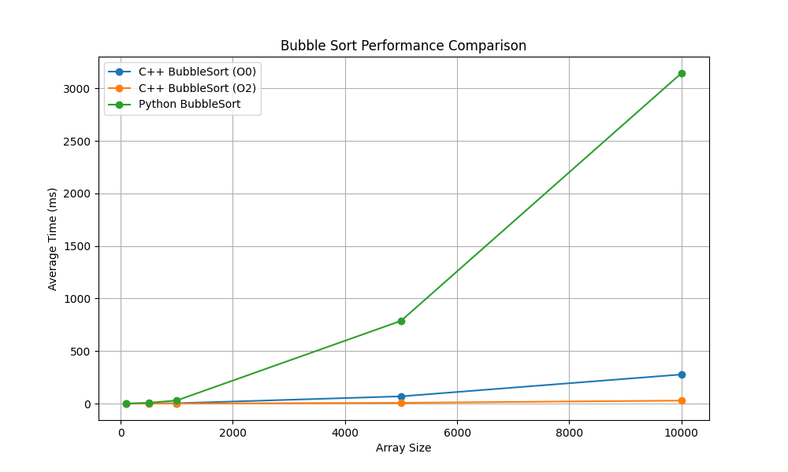
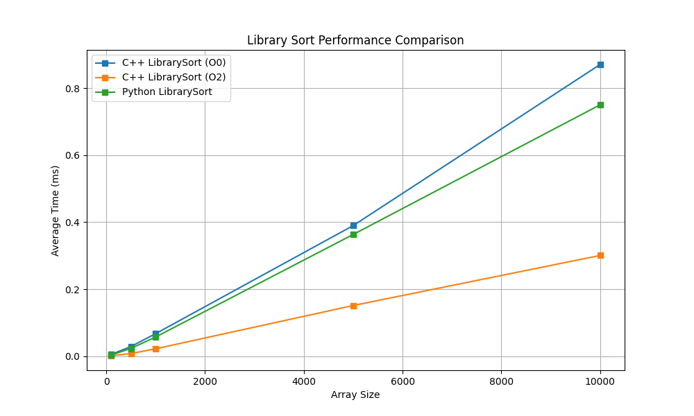
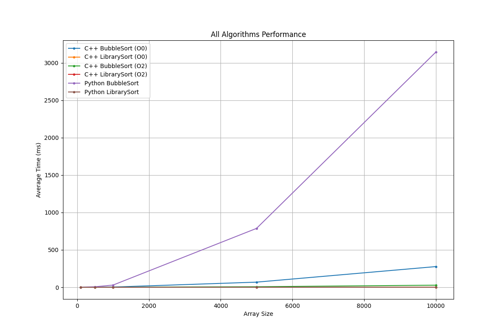

# Raport z Benchmarku: C++ vs Python
Data wygenerowania: 2026-02-24 21:45:11

## Opis testu
Poniższy raport przedstawia porównanie wydajności algorytmów sortowania zaimplementowanych w C++ i Pythonie.
Uwzględniono dwa algorytmy (**Bubble Sort** oraz domyślne `std::sort` / `list.sort()`) oraz wpływ flag kompilacji C++.

## Środowisko testowe
```text
OS: Windows 11
Architecture: AMD64
CPU: AMD Ryzen 9 6900HS with Radeon Graphics
CPU Cores: 16
RAM: 31.23 GB
Python Version: 3.13.12 (tags/v3.13.12:1cbe481, Feb  3 2026, 18:22:25) [MSC v.1944 64 bit (AMD64)]
C++ Compiler: Microsoft (R) C/C++ Optimizing Compiler Version 19.44.35219 for x64
Compilation Flags: /O2 /EHsc /std:c++17
```

## Wyniki w formie Wykresów




## Tabele Wyników

### Wyniki: Bubble Sort
| Język | Flaga | Rozmiar | Średni czas [ms] | Min-Max [ms] |
|--------|-------|---------|------------------|--------------|
| Python | - | 100 | 0.24 | 0.24 - 0.24 |
| Python | - | 500 | 6.82 | 6.77 - 6.86 |
| Python | - | 1000 | 29.50 | 29.10 - 29.86 |
| Python | - | 5000 | 787.63 | 779.95 - 795.70 |
| Python | - | 10000 | 3145.97 | 3117.50 - 3180.41 |
| C++ | O0 | 100 | 0.03 | 0.03 - 0.04 |
| C++ | O0 | 500 | 0.71 | 0.70 - 0.71 |
| C++ | O0 | 1000 | 3.00 | 2.84 - 3.34 |
| C++ | O0 | 5000 | 68.74 | 68.50 - 68.91 |
| C++ | O0 | 10000 | 276.79 | 275.76 - 278.33 |
| C++ | O2 | 100 | 0.00 | 0.00 - 0.01 |
| C++ | O2 | 500 | 0.08 | 0.07 - 0.08 |
| C++ | O2 | 1000 | 0.29 | 0.29 - 0.30 |
| C++ | O2 | 5000 | 7.16 | 6.98 - 7.58 |
| C++ | O2 | 10000 | 28.16 | 27.98 - 28.56 |

### Wyniki: Library Sort
| Język | Flaga | Rozmiar | Średni czas [ms] | Min-Max [ms] |
|--------|-------|---------|------------------|--------------|
| Python | - | 100 | 0.00 | 0.00 - 0.00 |
| Python | - | 500 | 0.02 | 0.02 - 0.03 |
| Python | - | 1000 | 0.06 | 0.06 - 0.06 |
| Python | - | 5000 | 0.36 | 0.34 - 0.39 |
| Python | - | 10000 | 0.75 | 0.74 - 0.76 |
| C++ | O0 | 100 | 0.01 | 0.00 - 0.01 |
| C++ | O0 | 500 | 0.03 | 0.03 - 0.03 |
| C++ | O0 | 1000 | 0.07 | 0.06 - 0.07 |
| C++ | O0 | 5000 | 0.39 | 0.38 - 0.40 |
| C++ | O0 | 10000 | 0.87 | 0.81 - 1.09 |
| C++ | O2 | 100 | 0.00 | 0.00 - 0.00 |
| C++ | O2 | 500 | 0.01 | 0.01 - 0.01 |
| C++ | O2 | 1000 | 0.02 | 0.02 - 0.03 |
| C++ | O2 | 5000 | 0.15 | 0.15 - 0.16 |
| C++ | O2 | 10000 | 0.30 | 0.30 - 0.31 |

## Zapis Wyników do CSV
Pośrednie wyniki ze wszystkich pomiarów można znaleźć w dołączonym pliku [report_2026-02-24_21-45-10.csv](./report_2026-02-24_21-45-10.csv).

## Wnioski