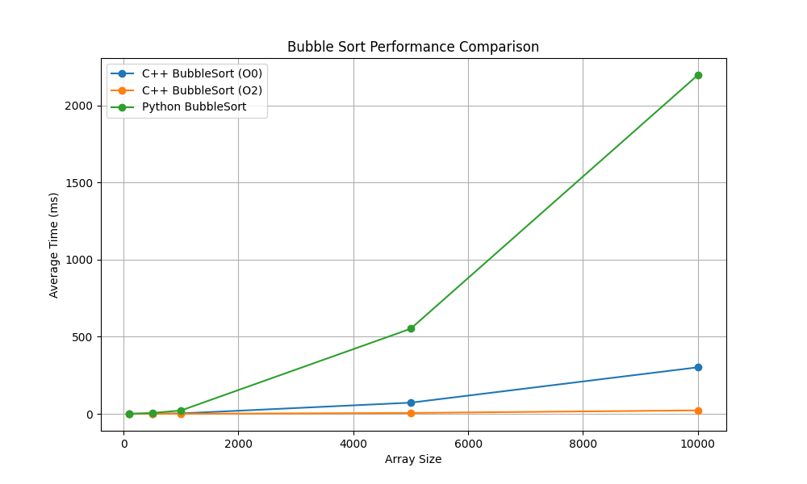
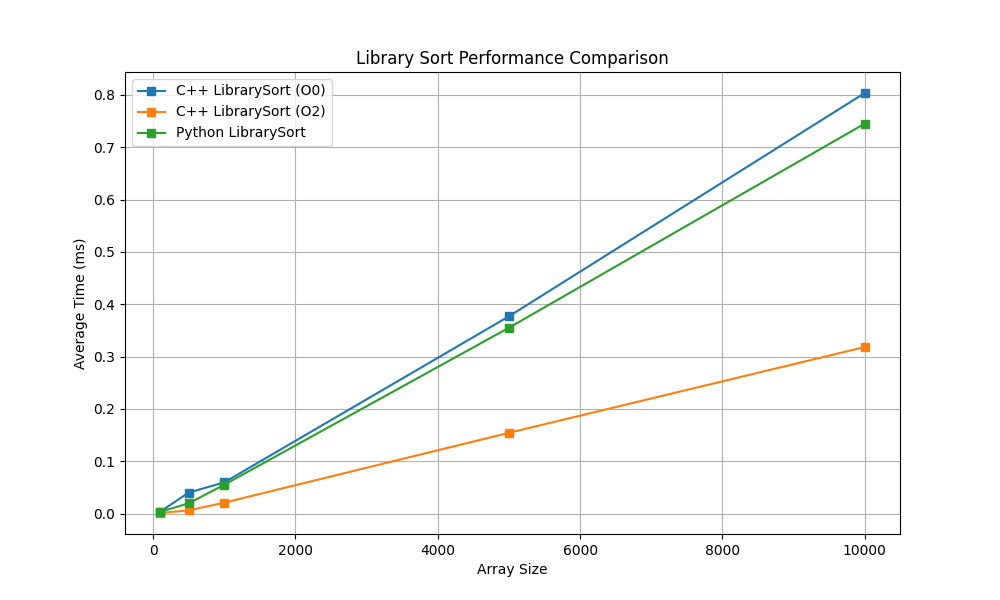
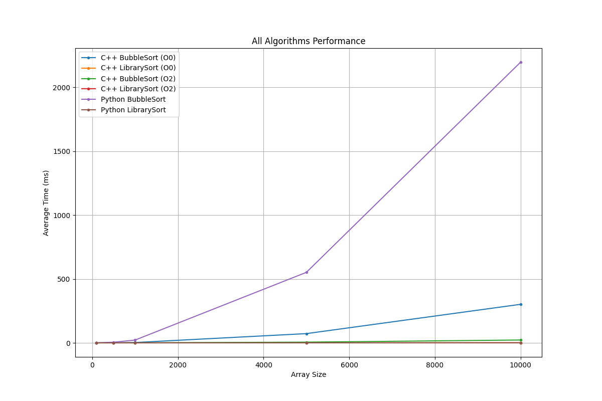

# Raport z Benchmarku: C++ vs Python
Data wygenerowania: 2026-02-25 19:58:02

## Opis testu
Poniższy raport przedstawia porównanie wydajności algorytmów sortowania zaimplementowanych w C++ i Pythonie.
Uwzględniono dwa algorytmy (**Bubble Sort** oraz domyślne `std::sort` / `list.sort()`) oraz wpływ flag kompilacji C++.

## Środowisko testowe
```text
OS: Windows 11
Architecture: AMD64
CPU: AMD64 Family 26 Model 96 Stepping 0, AuthenticAMD
CPU Cores: 12
RAM: 16.00 GB
Python Version: 3.14.2 (tags/v3.14.2:df79316, Dec  5 2025, 17:18:21) [MSC v.1944 64 bit (AMD64)]
C++ Compiler: g++ (MinGW-W64 x86_64-ucrt-posix-seh, built by Brecht Sanders, r8) 13.2.0
Compilation Flags: /O2 /EHsc /std:c++17
```

## Wyniki w formie Wykresów




## Tabele Wyników

### Wyniki: Bubble Sort
| Język | Flaga | Rozmiar | Średni czas [ms] | Min-Max [ms] |
|--------|-------|---------|------------------|--------------|
| Python | - | 100 | 0.20 | 0.19 - 0.20 |
| Python | - | 500 | 5.20 | 5.12 - 5.25 |
| Python | - | 1000 | 21.72 | 21.44 - 22.04 |
| Python | - | 5000 | 552.18 | 544.82 - 559.81 |
| Python | - | 10000 | 2198.14 | 2178.66 - 2206.76 |
| C++ | O0 | 100 | 0.03 | 0.02 - 0.03 |
| C++ | O0 | 500 | 0.74 | 0.66 - 1.05 |
| C++ | O0 | 1000 | 2.65 | 2.64 - 2.66 |
| C++ | O0 | 5000 | 72.33 | 71.60 - 73.41 |
| C++ | O0 | 10000 | 301.80 | 300.44 - 303.39 |
| C++ | O2 | 100 | 0.00 | 0.00 - 0.01 |
| C++ | O2 | 500 | 0.07 | 0.06 - 0.08 |
| C++ | O2 | 1000 | 0.27 | 0.26 - 0.28 |
| C++ | O2 | 5000 | 5.59 | 5.59 - 5.60 |
| C++ | O2 | 10000 | 22.28 | 21.86 - 23.60 |

### Wyniki: Library Sort
| Język | Flaga | Rozmiar | Średni czas [ms] | Min-Max [ms] |
|--------|-------|---------|------------------|--------------|
| Python | - | 100 | 0.00 | 0.00 - 0.01 |
| Python | - | 500 | 0.02 | 0.01 - 0.03 |
| Python | - | 1000 | 0.06 | 0.05 - 0.06 |
| Python | - | 5000 | 0.36 | 0.35 - 0.36 |
| Python | - | 10000 | 0.75 | 0.73 - 0.78 |
| C++ | O0 | 100 | 0.00 | 0.00 - 0.01 |
| C++ | O0 | 500 | 0.04 | 0.02 - 0.10 |
| C++ | O0 | 1000 | 0.06 | 0.05 - 0.07 |
| C++ | O0 | 5000 | 0.38 | 0.37 - 0.39 |
| C++ | O0 | 10000 | 0.80 | 0.79 - 0.82 |
| C++ | O2 | 100 | 0.00 | 0.00 - 0.00 |
| C++ | O2 | 500 | 0.01 | 0.00 - 0.01 |
| C++ | O2 | 1000 | 0.02 | 0.01 - 0.03 |
| C++ | O2 | 5000 | 0.15 | 0.15 - 0.16 |
| C++ | O2 | 10000 | 0.32 | 0.31 - 0.34 |

## Zapis Wyników do CSV
Pośrednie wyniki ze wszystkich pomiarów można znaleźć w dołączonym pliku [report_2026-02-25_19-58-01.csv](./report_2026-02-25_19-58-01.csv).

## Wnioski

1. Porównanie wydajności C++ vs Python

Python - Język interpretowany. 

C++ (O0) - Język kompilowany bez optymalizacji - przeznaczona do debug.

C++ (O2) - Język kompilowany z optymalizacją.

Analiza wyników algorytmu wykazuje znaczące rozbieżności w czasie egzekucji kodu na korzyść języka kompilowanego:

    Przy maksymalnym rozmiarze danych (n=10000), implementacja w Pythonie (2198,14 ms) sortowania bąbelkowego jest ~7,3 raza wolniejsza od implementacji tego samego algorytmu w C++ z flagą O0 (301,80 ms).

    Porównując Pythona do zoptymalizowanej wersji C++ (O2), różnica pogłębia się drastycznie – Python jest ~98,6 raza wolniejszy (2198,14 ms vs 22,28 ms).

    W przypadku Library Sort, różnice ulegają zatarciu. Python osiąga wyniki niemal identyczne jak C++ (O0) (0,75 ms vs 0,80 ms), co wynika z faktu, że metoda .sort() w Pythonie korzysta z niskopoziomowych, skompilowanych procedur języka C.

    W tym wypadku Python jest nawet szybszy od C++ (O0) (0,75 ms vs 0,80 ms). ale jest nadal przezwyciężony przez skompilowaną i zoptymalizowaną wersję C++ (O2) (0,32 ms), która jest ~2,5 razy szybsza od Pythona.

2. Wpływ rozmiaru danych na czas wykonywania

Zgodnie z teoretyczną złożonością O(n2) dla sortowania bąbelkowego, wzrost rozmiaru danych o czynnik 10 (z 1000 do 10000 elementów) skutkuje około 100-krotnym wydłużeniem czasu operacji:

    W Pythonie wzrost ten wynosi ~101,2 raza (z 21,72 ms do 2198,14 ms).

    W C+ (O2) wzrost wynosi ~82,5 raza (z 0,27 ms do 22,28 ms).

    Dla algorytmów bibliotecznych (O(nlogn)), ten sam wzrost rozmiaru danych powoduje jedynie ~12-16 krotny wzrost czasu, co potwierdza ich znacznie lepszą skalowalność.

3. Wnioski końcowe

Wyniki prezentują fundamentalną przewagę języków kompilowanych wobec języków interpretowanych.

Jednak wyniki Pythona w sekcji Library Sort pokazują, że nowoczesne języki interpretowane są w stanie zredukować swoje ograniczenia wydajnościowe poprzez delegowanie krytycznych obliczeniowo zadań do gotowych, natywnych modułów binarnych.

Jest widoczne jednak że znaczący jest sposób kompilacji kodu, i że optymalizacja kodu jest w stanie przynieść ogromne korzyści wydajnościowe.

W przypadku C++ przejście z flagi kompilacji O0 na O2 skróciło czas Bubble Sort dla największego zbioru ~13,5 raza (z 301,80 ms do 22,28 ms) dzięki efektywnej redukcji ilości instrukcji procesora.
